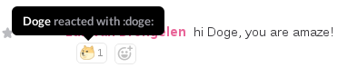

# dogebot

A Slack bot that'll place a `:doge:` reaction (you'll have to add it as a
custom emoticon to your Slack) on posts containing at least one of the
following words: wow, amaze, excite.

## Building dogebot

To build it the way I do, you'll need a working Go compiler, and
[gb](https://getgb.io/), so you can clone this repository, and run `gb build`.

Alternatively, though, you could simply try to do

    go get github.com/Luit/dogebot/src/dogebot

Whatever works best for you.

## Running dogebot

You'll need a bot token for your Slack, which you can do at
https://slack.com/services/new/bot

The token you get can be passed to dogebot through the `SLACK_TOKEN`
environment variable.

The bot will automatically be added to your default (mandatory) channel. To
get dogebot in the channel you want, invite it using a regular Slack account.

